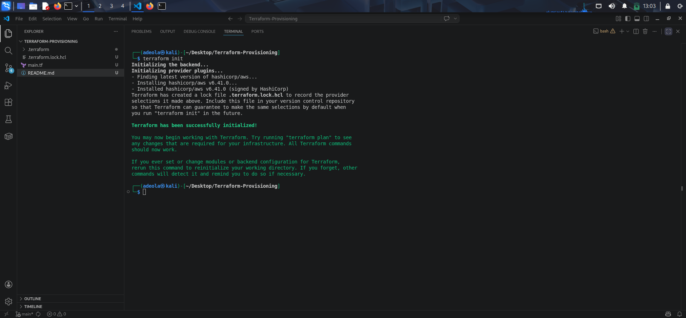
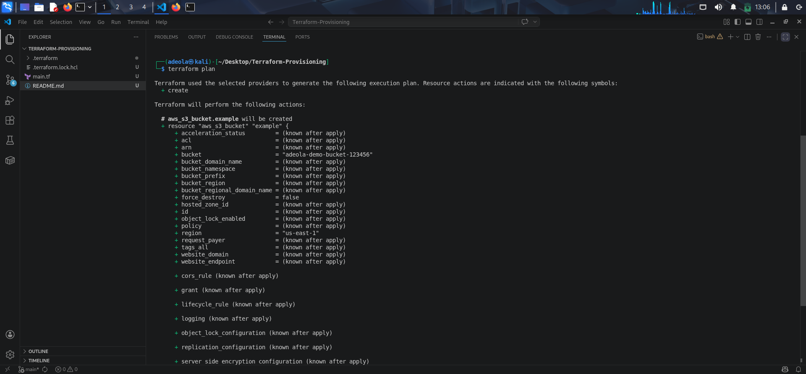
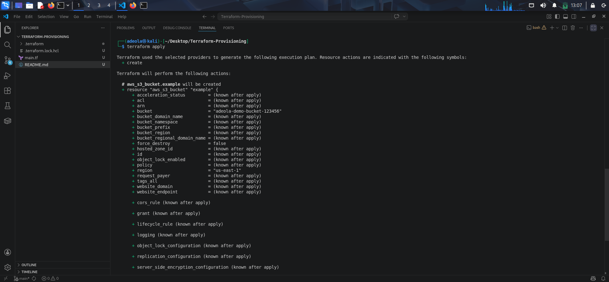
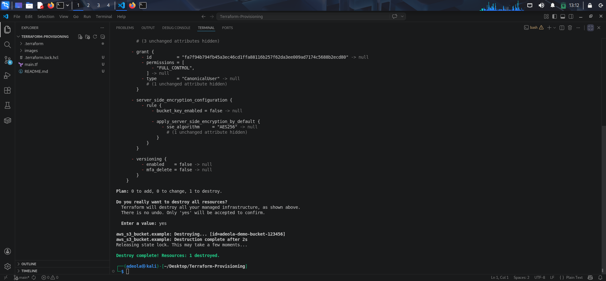

# Terraform Provisioning Infrastructure
**Goal: Assess full workflow understanding and state awareness.**

## Student Task
### 1.  What is the Terraform state file used for?

The Terraform state file (`terraform.tfstate`) is used to track the current state of your infrastructure.

It maps the resources defined in your `.tf` files to the real-world resources (e.g., AWS EC2 instances), allowing Terraform to:

- Know what already exists
- Determine what changes are needed (plan)
- Apply updates without recreating everything

### 2.  Why is storing state locally risky in a team environment?
Storing state locally is risky because:

- No collaboration – teammates don’t share the same state
-  State conflicts – multiple people can overwrite changes
- No locking – simultaneous runs can corrupt infrastructure
-  Data loss risk – if a machine crashes, state is lost
-  Security issues – sensitive data (like secrets) may be exposed

### 3. What is a remote backend?

A remote backend is a shared storage location where Terraform state is stored remotely instead of locally.

It provides:

-  Centralized state management
-  State locking (prevents conflicts)
-  Collaboration across teams
- Better security and versioning

### 4. Write an example backend block for an S3 remote backend.

The file is the updated .tf

For terraform commands, what commands do u run to provision infra with terraform

## Deliverables
- Screenshots of each Terraform command
> **terraform init**

>**terraform plan**

>terraform apply
  

>terraform destroy

